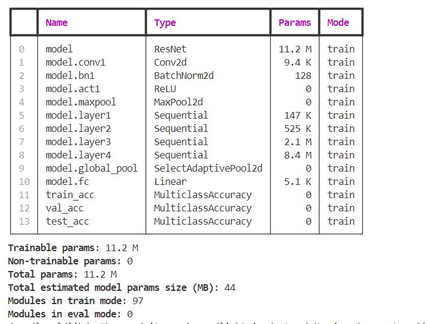

# EMLOv4 - Session4
# Docker Compose - Dog Breed Classification using PyTorch Lightning

## Overview
This is the repository which contains the MLOps work done for Pytorch Lightning assignment. This assignment implements a dog breed classification model using PyTorch Lightning, trained on the Dogs Breed Classification dataset from Kaggle. It features real-time progress visualization using Rich, model performance tracking with TensorBoard, and a Docker container for easy deployment.

This project implements image classification using PyTorch Lightning for two tasks:

Cat vs Dog Classification - Classifies images into two categories: cat or dog.
Dog Breed Classification - Classifies dog images into one of 10 predefined breeds.

Both tasks use ResNet-18, a pre-trained CNN model from the timm library, fine-tuned for the specific classification tasks. The model is trained, validated, and tested using PyTorch Lightning for efficient and scalable model training.

## Folder Structure


```
s04-pytorch-lightning
├── data
│   ├── train                     # Training images
│   ├── validation                # Validation images
├── logs
│   ├── dogbreed_classification   # Logs and checkpoints for dog breed classification
│   │   ├── checkpoints           # Model checkpoints for dog breed classification
│   ├── infer_log.log             # Log for inference
│   ├── train_log.log             # Log for training
│   ├── validate_log.log          # Log for validation
├── output                        # Directory where predicted images are saved after inference
├── samples                       # Directory for input images to test during inference
├── src
│   ├── datamodules
│   │   ├── catdog_datamodule.py  # Data module for cat vs dog classification
│   │   └── dogbreed_datamodule.py # Data module for dog breed classification
│   ├── eval.py                   # Evaluation script to validate model performance
│   ├── infer.py                  # Inference script to predict on sample images
│   ├── models
│   │   ├── catdog_classifier.py  # Model for cat vs dog classification
│   │   └── dogbreed_classifier.py # Model for dog breed classification
│   ├── train.py                  # Main training script
│   └── utils
│       ├── logging_utils.py      # Logging utility functions
```

The folders `data` and `logs` will be created when the `train` service is run. The folder `output` is created to store the predictions when `infer` service is run.  

### Key Features

**PyTorch Lightning Framework:** Utilizes PyTorch Lightning for efficient model training and management.
**Rich Progress Bar:** Provides interactive and informative progress bars during training using Rich library.
**TensorBoard Integration:** Enables real-time visualization of model metrics and performance through TensorBoard.
**Docker Containerization:** Includes Docker setup for easy deployment and reproducibility across different environments.

### Dataset
This project uses the Dogs Breed Classification dataset available on Kaggle. The dataset contains images of various dog breeds, which are used to train a classification model. The datset contains breeds of dogs in different folder - had to preprocess the data Folder names were used as lables/target variable, then data was split into train/test/validation set

Note: tried using uv, but in gitpod was running out of space. so shifted to pip install in requirements.txt

## Files Overview
### `dogbreed_datamodule.py`
This file contains the `DogBreedImageDataModule` class, a PyTorch Lightning DataModule that handles loading, splitting, and transforming the Dog Breed Images dataset. The module downloads the dataset, organizes it into training and validation sets, and provides data loaders for efficient data handling.

#### Key features:

**Data Preparation:** Automatically downloads the dataset from Google Drive and extracts it.
**Data Splitting:** Splits the dataset into training and validation sets using a configurable validation split ratio.
**Transformations:** Applies data augmentations and normalization using torchvision.transforms.
**Dataloader Creation:** Provides train, validation, and test data loaders.

### `dogbreed_classifier.py`
The `DogBreedClassifier` class defines the model architecture for the dog breed classification task. It uses a pre-trained ResNet-18 model, modified to classify dog images into one of 10 dog breeds. The model consists of the following layers:

**Backbone:** Pre-trained ResNet-18, which is efficient for feature extraction.
**Fully Connected Layer:** The final layer is adjusted to predict 10 dog breeds.
The classifier is optimized using the Adam optimizer with a learning rate of 1e-3.

#### Key features:

**Model Architecture:** Utilizes a ResNet-18 backbone from timm (PyTorch Image Models) for transfer learning.
**Training Step:** Computes cross-entropy loss for multi-class classification and logs the training accuracy.
**Validation & Test Step:** Performs validation and testing by computing accuracy and loss on the validation/test datasets.
**Optimization:** Uses the Adam optimizer to update the model weights during training.
**Metrics:** Tracks multi-class accuracy using `torchmetrics`.

## Docker Execution
Before running the containers, you need to build the images defined in your `docker-compose.yml`. Use the following command:

```
docker compose build
```
This command will read the `docker-compose.yml` file and build all the services specified under the build directive (if applicable).

### Start the Services

To start the services as defined in `docker-compose.yml`, use the following command:

```
docker compose up
```
This will create and start the containers for all the services. If the images haven't been built yet, Docker Compose will attempt to build them before starting the containers.

<h4>Docker Images - from GitPod</h4>

<div style="display: grid; grid-template-columns: 1fr; gap: 10px;">
  
  
</div>

### Start Train Service

If we want to trigger the execution of a specific service defined in your docker-compose.yml (e.g., training, validation, or inference), we can specify the service name in the docker-compose command.
To start only the train service, run the following command:

```
docker compose run train
```
This would trigger the following command internally by the train service 

```
python src/train.py --image_type [1 | 2]
```

`--image_type:`
- `1`: Train a Cat vs Dog classifier.
- `2`: Train a Dog Breed classifier (default).
Checkpoints will be saved in `logs/dogbreed_classification/checkpoints/`.

#### Logging
Logs are stored in the logs/ directory.

TensorBoard logs can be visualized by running:

```
tensorboard --logdir logs/dogbreed_classification/
```

<h4>Train Logs - from GitPod</h4>

<div style="display: grid; grid-template-columns: 1fr; gap: 10px;">
  
  
  
  
</div>


### Start Validation Service
To validate the model on the validation dataset, use:


```
docker compose run evaluate
```
This would trigger the following command internally by the validation service

```
python src/eval.py --image_type [1 | 2] --checkpoint logs/dogbreed_classification/checkpoints/epoch=00-val_loss=0.35.ckpt
```
If the `--checkpoint` argument is not provided, the latest checkpoint in the `logs/dogbreed_classification/checkpoints/` directory will be used.

<h4>Validation Logs - from GitPod</h4>

<div style="display: grid; grid-template-columns: 1fr; gap: 10px;">
  
  
</div>

### Start Inference Service

Ensure the images to be used for inferencing are placed in the `samples` folder. To run inference on sample images:


```
docker compose run infer
```

This would trigger the following command internally by the infer service


```
python src/infer.py --image_type [1 | 2] --ckpt_path logs/dogbreed_classification/checkpoints/epoch=00-val_loss=0.35.ckpt --input_folder samples --output_folder output
```

The predicted images will be saved in the output/ directory, along with the predicted label and confidence score.

<h4>Infer Logs - from GitPod</h4>

<div style="display: grid; grid-template-columns: 1fr; gap: 10px;">
  
  
  
  
</div>

<h4>Predictions - from GitPod</h4>

<div style="display: grid; grid-template-columns: repeat(2, 1fr); gap: 10px;">
  
  
  
  
</div>

